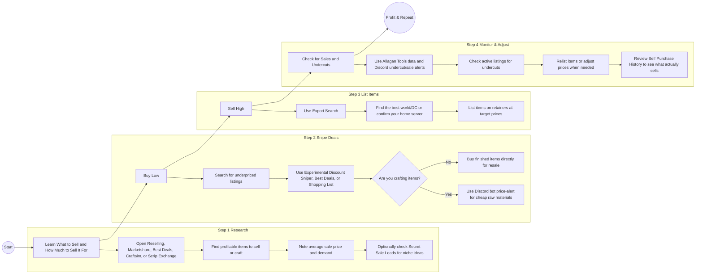

#  How to Earn Gold with Cross Realm Trading 

Simple buy low in one realm, deposit an item in your warband bank, move it to another realm and sell high!

[ Watch this tutorial](https://youtu.be/31ey9tEPyTQ?t=160) if you're new to cross realm trading. It covers how to move items from one realm to another for trading.

##  TL;DR: How to Make Gil with a 4-Step Process

Here are some of the top ways to use Saddlebag for FFXIV, made simple for new users:

### 1.  **Learn What to Sell and How Much to Sell It For** 

Use the reselling, marketshare, best deals or craftsim searches to find good items to sell or craft (if youre an omnicrafter) and determine the average price you can sell them for:

-  [Reselling Trade Search](https://saddlebagexchange.com/queries/recommended)
-  [Best Deals](https://saddlebagexchange.com/ffxiv/best-deals/recommended)
-  [Marketshare](https://saddlebagexchange.com/ffxiv/marketshare/queries)
-  [Craftsim Search](https://saddlebagexchange.com/ffxiv/craftsim/queries)
-  [Currency Conversion Search](https://saddlebagexchange.com/ffxiv/scrip-exchange)
-  [Secret Sale Leads](https://github.com/ff14-advanced-market-search/saddlebag-with-pockets/wiki/FFXIV-Sale-Leads)

### 2.  **Buy Low**

Search for good deals on those items using the [Experimental Discount Sniper](https://github.com/ff14-advanced-market-search/saddlebag-with-pockets/wiki/FFXIV-Experimental-Discount-Price-Sniper), reselling search, shopping list, or best deals, then buy them if not crafting. If you are crafting, use the [Discord bot price-alert](https://saddlebagexchange.com/price-sniper) to know when there are deals on your raw materials:

-  [Reselling Trade Search](https://saddlebagexchange.com/queries/recommended)
-  [Best Deals](https://saddlebagexchange.com/ffxiv/best-deals/recommended)
-  [Discord Bot Price-Alert](https://saddlebagexchange.com/wow/price-alert)
-  [Experimental Discount Sniper](https://github.com/ff14-advanced-market-search/saddlebag-with-pockets/wiki/FFXIV-Experimental-Discount-Price-Sniper)
-  [Bulk Crafting Shopping List](https://saddlebagexchange.com/wow/shopping-list)

### 3.  **Sell High**

In FFXIV you don't really need to make many alts and sell on different servers, our tools are geared towards selling on your own home server. Unlike WoW where you can make a fresh alt and start selling in 10 seconds, FFXIV requires you level to 20 and that can take time to make alts on each server.  Its not really needed unless you really want to hardcore gil grind.

However if you have many alts and 2 accounts to move items between them, then you can sell anywhere! Use the export search to find the best realm with the highest population to sell any items you buy or craft.

-  [Export Search](https://saddlebagexchange.com/queries/world-comparison)

### 4.  **Check for Sales and Undercuts**

Use our alerts or allagan tool integration to help monitor your active listings and alert you when you should relist your items or when sales are made:

-  [Allagan Tools Search](https://saddlebagexchange.com/allagan-data)
-  [Discord Bot Undercut and Sale Alerts](https://saddlebagexchange.com/undercut)
-  [Self Purchase History Search](https://saddlebagexchange.com/ffxiv/self-purchase)
___

