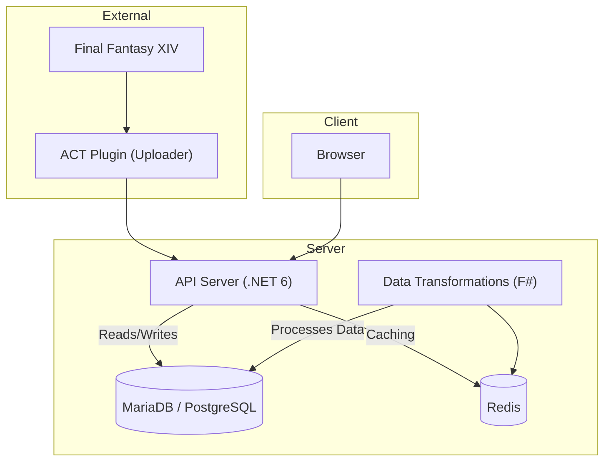

## API Overview

### **Root Directory**

- **Dockerfile**: Defines the Docker image configuration for building and running the application in a containerized environment.

- **LICENSE**: Contains the licensing terms under which the project is distributed.

- **README.md**: The main documentation file providing an overview of the project, usage instructions, and other relevant information.

- **Universalis.sln**: The Visual Studio solution file that includes all the projects within the repository.

- **build.cmd**, **build.sh**, **build.ps1**: Scripts for building the project on Windows (`.cmd`), Unix/Linux (`.sh`), and PowerShell (`.ps1`) platforms.

### **Directories**

#### **build/**

Contains build scripts and configuration files for compiling and building the project.

- **Build.cs**, **Configuration.cs**: C# scripts that manage the build process and configurations.

- **Directory.Build.props**, **Directory.Build.targets**: MSBuild properties and targets applied to all projects in the solution.

- **Properties/launchSettings.json**: Defines settings for launching the application during development.

- **_build.csproj**, **_build.csproj.DotSettings**: Project files for the build scripts.

#### **deployment/**

Contains deployment configurations and resources.

- **docker-compose.yml**: Docker Compose file for deploying the application and its services.

- **prometheus.yml**: Configuration file for Prometheus monitoring.

- **README.md**: Documentation related to deployment processes.

#### **devenv/**

Contains development environment setup configurations.

- **docker-compose.yml**: Docker Compose file for setting up the development environment.

- **prometheus.yml**: Configuration for monitoring in the development environment.

- **README.md**: Documentation on setting up and using the development environment.

- **sqlinit/**: Contains SQL scripts for initializing the database.

    - **01-GrantUserPrivileges.sql** to **17-SeedUserAlertEventsTable.sql**: Scripts for creating databases, tables, and seeding initial data.

- **websocket-client/**: Contains a sample WebSocket client for testing purposes.

    - **index.js**: JavaScript implementation of the WebSocket client.

    - **package.json**, **package-lock.json**: Node.js package configuration files.

#### **src/**

The main source code directory containing all the application modules.

##### **Universalis.Application/**

The core application project.

- **Program.cs**: The entry point of the application.

- **Startup.cs**: Configures services and the application's request pipeline.

- **appsettings.json**: Application configuration settings.

- **Common/**: Contains common utilities and helpers.

    - **IPriceable.cs**, **InputProcessing.cs**, etc.: Interfaces and classes used across the application.

- **Controllers/**: Contains API controllers for handling HTTP requests.

    - **V1/**, **V2/**, **V3/**: Controllers for different API versions.

        - **V1/CurrentlyShownController.cs**: Handles requests for current market board data.

        - **V1/HistoryController.cs**: Handles requests for historical market data.

        - **V2/AggregatedMarketBoardDataController.cs**: Provides aggregated market data.

        - **V3/Game/**: Controllers related to game data.

            - **DataCentersController.cs**, **WorldsController.cs**: Provide data center and world (server) information.

        - **V3/Market/**: Controllers related to market data.

            - **OverviewController.cs**, **SalesController.cs**: Provide market overview and sales data.

- **ExceptionFilters/**: Contains filters for global exception handling.

- **Realtime/**: Implements real-time data handling and WebSocket support.

    - **Messages/**: Defines message formats for real-time events.

    - **SocketProcessor.cs**: Processes WebSocket connections and messages.

- **Uploads/**: Handles data uploads, including schemas and behaviors.

    - **Schema/**: Defines data schemas for uploads.

    - **Behaviors/**: Defines behaviors for processing uploads.

- **Views/**: Contains view models used by the controllers to structure response data.

    - **V1/**, **V2/**, **V3/**: View models for different API versions.

##### **Universalis.Alerts/**

Handles alerting functionality within the application.

- **DiscordAlertsProvider.cs**: Provides alert notifications via Discord.

- **AlertExtensions.cs**, **IDiscordAlertsProvider.cs**: Supporting classes and interfaces for alerting features.

##### **Universalis.Common/**

Contains common code and utilities shared across different modules.

- **Caching/**: Interfaces and implementations for caching mechanisms.

- **GameData/**: Provides access to game data such as items, worlds, and data centers.

##### **Universalis.DbAccess/**

Data access layer for interacting with databases and Redis.

- **AccessControl/**: Manages API keys and trusted sources for access control.

- **MarketBoard/**: Data access code specific to market board data.

- **Uploads/**: Data access code for uploads and statistics.

- **Migrations/**: Database migration scripts for schema changes.

- **Metrics/**: Integration with Prometheus for metrics collection.

- **RedisDatabases.cs**, **Util.cs**, etc.: Utility classes for database operations.

##### **Universalis.Entities/**

Defines entity models representing data structures used throughout the application.

- **AccessControl/**, **MarketBoard/**, **Uploads/**: Entities related to their respective domains.

- **Materia.cs**, **TradeVelocity.cs**, etc.: Specific entities used in market data and other functionalities.

##### **Universalis.GameData/**

Provides implementations for accessing game-related data.

- **DataCenter.cs**, **World.cs**, **IGameDataProvider.cs**: Classes and interfaces for game data.

##### **Universalis.Mogboard/**

Contains code for integrating with Mogboard, the frontend application.

- **Entities/**: Data structures for user lists and other shared entities.

- **Doctrine/**: Parsers and serializers for Doctrine types used in Mogboard.

- **UserListsService.cs**: Service for handling user lists.

##### **Tests/**

Contains test projects for various modules to ensure code quality and correctness.

- **Universalis.Application.Tests/**: Tests for the application layer.

- **Universalis.DbAccess.Tests/**: Tests for the data access layer.

- **Universalis.GameData.Tests/**: Tests for game data access code.

- **Universalis.Mogboard.Tests/**: Tests for Mogboard integration.

- **Universalis.DataTransformations.Tests/**: Tests for data transformation logic.

- **Universalis.Tests/**: General tests for the Universalis project.

---

### **Overview**

The **Universalis** repository is a .NET application serving as a crowdsourced market board aggregator for **Final Fantasy XIV**. It provides APIs for retrieving market data, supports real-time updates via WebSockets, and integrates with a frontend application called **Mogboard**.

Key components and features include:

- **API Controllers**: Serve market data through RESTful endpoints, supporting multiple API versions.

- **Data Access Layer**: Interacts with relational databases (**PostgreSQL**, **MariaDB**) and caching systems (**Redis**) to store and retrieve market data.

- **Real-Time Data**: Implements WebSocket support for real-time market updates.

- **Uploads Handling**: Processes data uploads from trusted sources, including validation and aggregation.

- **Alerts System**: Sends notifications and alerts via platforms like Discord.

- **Game Data Integration**: Provides access to game-specific data such as items, worlds, and data centers.

- **Deployment Configurations**: Uses **Docker** and **Docker Compose** for containerization, easing deployment and development setup.

- **Monitoring and Metrics**: Integrates with **Prometheus** for collecting metrics and monitoring the application's performance.

- **Testing**: Comprehensive test suites across various modules to ensure reliability and correctness.
